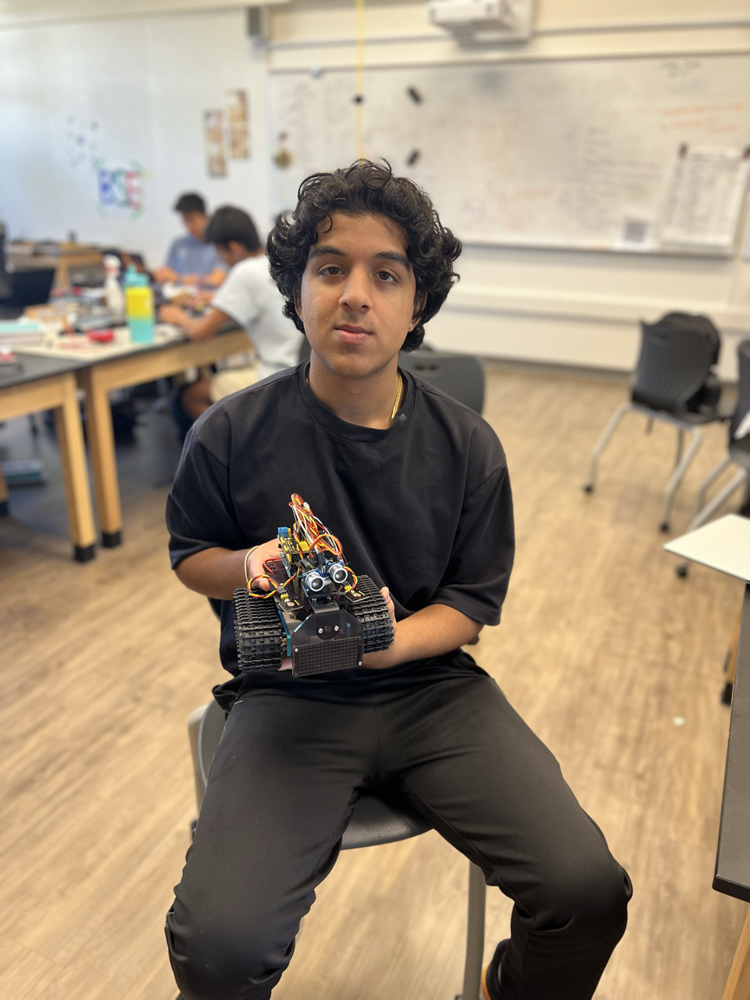

# Mini Tank Robot 

I decided to build a mini-tank robot. It can use treads to move, and it also has various sensors that it can use to detect its environment and have various reactions. 

| **Engineer** | **School**                 | **Area of Interest**   | **Grade** |
|:--:|:--:|:--:|:--:|
| Kapil A       | Menlo Atherton High school | Electrical Engineering | Incoming Sophomore 

  

# Final Milestone
<iframe width="560" height="315" src="https://www.youtube.com/embed/T1ZMqzTfkSY" title="YouTube video player" frameborder="0" allow="accelerometer; autoplay; clipboard-write; encrypted-media; gyroscope; picture-in-picture; web-share" allowfullscreen></iframe>

### Summary 
For this milestone, I made it so the tank would be able to avoid objects. It works by the ultrasonic sensor being able to read the distance between itself and whatever is in front of it. If the ultrasonic sensor was 5 inches or closer to an object it would check if the left was clear if so it would turn to the left and go that direction if the left was not clear then it would check the right, if the right was not clear it would backup and turn around and go the opposite direction. Since my previous milestone I added functionality to the servo and I also added functionality to the ultrasonic sensor. I also added functionality with bluetooth so that I can manually control the bot but I can also switch modes so I can switch from moving forward to obstacle avoidance and I could also change to object following. 

### Challenges Faced
The biggest challenges were when programming. At first I had the the code executing when it would turn away from the obstacle after the the code where it stopped it and the code calculating the distance of the object. because of that it would run both pieces of codes all the time instead of just running them at the the right time because the distance was not updated when going through the loop. The solution was placing that piece of code above the code that stopped the tank, by doing this it would run through the code multiples times for each step and update the value making the code run. 
Overall my biggest challenges at BSE have been with my starter when it kept shorting because the ground was connected to the five-volt connection. Another one was with the programming of the obstacle avoidance. 
The biggest triumphs where when I worked out the issue with it first turning right then left and when I made a bluetooth drive for the tank. 
### What I learned 
in bluestamp I learned the basics of electronics like how to make a circuit on a breadboard. I also learned how to use sensors with an ardiuno, and the basic syntax of C++ and how to use things like cases. In the future I want to deeper into electronics and learn more about circuits and how to make custom parts. I also want to learn more about mechanical engineering specifically how to use CAD to design mechanical systems and be able to make them.

# Second Milestone
<iframe width="560" height="315" src="https://www.youtube.com/embed/aJizkXOvEMc" title="YouTube video player" frameborder="0" allow="accelerometer; autoplay; clipboard-write; encrypted-media; gyroscope; picture-in-picture; web-share" allowfullscreen></iframe>

### Summary 
for my second milestone, I wrote code so that I was able to run the robot using Bluetooth. With that code with different inputs, I would match the input and if it was the correct input I would either make the robot go forward backward or turn left or right.  
I didn't use any new components I just programmed the motors to control their speed in direction. because they are dc motors they have two directions, so when programming them if I want it to turn right I have one motor turning normally while the other turns right. 
### Progress 
for my customization, I was able to add functionality with an ultrasonic sensor where it would follow an object. 
### Challenges faced 
One challenge I faced was with coding it I didn't really understand the way that the Bluetooth inputs were read so I didn't know how to make it so my robot was controlled. I then figured out I have to save my inputs as a variable then I used those to if I had a certain input it would drive a certain way whether it turned or went forwards or backward. Another challenge with driving it was one of the wheels wouldn't be powered, the reason for this is I was connected to one 9 volt battery which was running low on battery and two wasn't giving enough power so I soldered two of the 9-volt battery clips together so I could use two 9 volt batteries. 
### Next steps 
Next, I plan to add extra functionality with different sensors such as the photoresistors to react to the light levels and work with other sensors. 

# First Milestone
<iframe width="560" height="315" src="https://www.youtube.com/embed/kHHo6Isvda4" title="YouTube video player" frameborder="0" allow="accelerometer; autoplay; clipboard-write; encrypted-media; gyroscope; picture-in-picture; web-share" allowfullscreen></iframe> 

### Summary 
my first milestone with the mini tank robot was to assemble it and test all the components. I was able to successfully test the ultrasonic sensor, the photoresistors, the servo, and the Bluetooth module

### Components used 
- two photoresistors that change their resistance based on the light level.
- an IR sensor, which detects infrared signals.
- an ultrasonic sensor, which detects how far away an object is
- two dc motors.
- two treads
- two wheels
- panels for assembly
- a servo, which can make precise turns.
- an Arduino microcontroller
- an 1298p motor controller
-  a sensor shield v2
- and an led panel

Building the tank involved a few things I first had to assemble the wheel and the drive of it. For that, there was a prebuilt structure to which I could mount a DC motor to which I attached a wheel, I would also have another wheel on the same piece which would be connected so they can turn each other. There are two of those drives and I would mount a panel on top of those which contains the electronics such as the Arduino microcontroller and the attachments like the motor controller and the sensor shield. The motor controller is used to power the motor and makes me able to program their speed and direction. I can use the sensor shield to connect all the components to my Arduino. With the components and sensors, I can add extra functionality, where I can use them all to help react to its environment.
### Challenges Faced
 One challenge I faced was with the software particularly when it came to the IR sensor which I wasn't able to get working properly because the library wasn't working.
 ### Next Steps 
 After this, I plan to get the IR sensor working and get remote-controlled driving capabilities with either the Bluetooth or IR sensor and use those inputs to power the motors and make the robot drive wirelessly. 

# Starter Project
<iframe width="560" height="315" src="https://www.youtube.com/embed/oUL4bk-k7ME" title="YouTube video player" frameborder="0" allow="accelerometer; autoplay; clipboard-write; encrypted-media; gyroscope; picture-in-picture; web-share" allowfullscreen></iframe>
### Summary 

My starter project was the custom Arduino project. I made a thing using Arduino, that when you are at least ten centimeters from the ultrasonic sensor you would turn on an LED. If you were more than ten centimeters away it would turn off.

the components I used were 
-  an Arduino which is a microcontroller 
-   an adafruit proto shield on which I could make custom circuits on 
-    an led which provides light and an output
-    a resistor, which reduces and regulates the flow of current. 
- jumper wire, which connects components  
- and an ultrasonic sensor, which detects how far an object is.

all of the components are soldered to the proto shield which is connected to the Arduino which provides it power. and the connections needed. I used the jumper wires to wire them on Arduino connections to the ground and the five-volt connection. I also connected the ultrasonic sensor to a different ground and five-volt connection. I soldered the output of the ultrasonic sensor which went to the resistor which went to a resistor that regulated the current that went to an led which were all  soldered onto the proto shield. 
### Challenges Faced 
   A challenge I faced was getting the circuit right and issues with shorting.
  I first designed the circuit on a breadboard which taught me a lot about how circuits work and Power Rails, but when soldering it the circuit kept shorting. I realized that the board to which I was soldering the components had power rails that were already powered by a 5-volt connection so when I connected them to ground it would short. What I had to do was remake the circuit on a different part of the board which wouldn't already have a five-volt connection. For that, I had to make my own connections between the components because they didn't have power rails. 
### Next Steps
next I plan to work on my intensive project which is the mini tank robot. 
<!---
# Schematics 
Here's where you'll put images of your schematics. [Tinkercad](https://www.tinkercad.com/blog/official-guide-to-tinkercad-circuits) and [Fritzing](https://fritzing.org/learning/) are both great resoruces to create professional schematic diagrams, though BSE recommends Tinkercad becuase it can be done easily and for free in the browser. 

# Code
Here's where you'll put your code. The syntax below places it into a block of code. Follow the guide [here]([url](https://www.markdownguide.org/extended-syntax/)) to learn how to customize it to your project needs. 
-->
# Code

Integrated bluetooth code 

<pre style="background:#fdfdfd: border:none; height:40pc">
  
#include '<Servo.h>'

/*
 keyestudio Mini Tank Robot v2.0
 lesson 8.1
 motor driver
 http://www.keyestudio.com
*/ 
#define L_Pin A1   //define the pin of left photo resistor
#define R_Pin A2 
Servo myservo;  // create servo object to control a servo
// twelve servo objects can be created on most boards
int pos = 0;    // variable to store the servo position

int left_light; 
int right_light;
#define ML_Ctrl 13  //define the direction control pin of left motor
#define ML_PWM 11   //define the PWM control pin of left motor
#define MR_Ctrl 12  //define direction control pin of right motor
#define MR_PWM 3   // define the PWM control pin of right motor
unsigned char dark [] = {0xfe, 0x86, 0xdc, 0x20, 0x80, 0x70, 0x5e, 0x5e, 0xf0, 0x80, 0xf8, 0x10, 0x08, 0xff, 0x1e, 0xe3
};
unsigned char light [] ={0x00, 0x00, 0x09, 0x4a, 0x20, 0x0e, 0xf3, 0xc1, 0xf3, 0x0e, 0x00, 0x2a, 0x49, 0x00, 0x00, 0x00};
unsigned char sad[]={0x80, 0x4f, 0x29, 0x0b, 0x8b, 0xc9, 0xdf, 0xc0, 0xc0, 0xdf, 0xc9, 0x8b, 0x0b, 0x29, 0x4f, 0x80};

unsigned char happy[]={0x02, 0x1f, 0x13, 0x5f, 0xdf, 0x93, 0x9f, 0x82, 0x82, 0x9f, 0x93, 0x9f, 0x5f, 0x53, 0x1f, 0x02};
int trigPin = 5;    // Trigger
int echoPin = 4;    // Echo
long duration, cm, in;
void light_tra
cking(){
    if (left_light > 650 && right_light > 650) //the value detected photo resistor，go front
  {  
    forward();
    delay(250);
  } 
  else if (left_light > 650 && right_light <= 650)  //the value detected photo resistor，turn left
  {
    left();
    delay(250);
  } 
  else if (left_light <= 650 && right_light > 650) //the value detected photo resistor，turn right
  {
    right();
    delay(250);
  } 
  else  //other situations, stop
  {
    stop();
    delay(250);
  }
}
void forward(){
  digitalWrite(ML_Ctrl,LOW);//set the direction control pin of left motor to LOW
  analogWrite(ML_PWM,150);//set the PWM control speed of left motor to 200
  digitalWrite(MR_Ctrl,LOW);//set the direction control pin of right motor to LOW
  analogWrite(MR_PWM,150);//set the PWM control speed of right motor to 200
}
void back(){
  digitalWrite(ML_Ctrl,HIGH);
  analogWrite(ML_PWM,150);
  digitalWrite(MR_Ctrl,HIGH);
  analogWrite(MR_PWM,150);
}
void right (){
  digitalWrite(ML_Ctrl, LOW);
  analogWrite(ML_PWM,200);
  digitalWrite(MR_Ctrl,HIGH);
  analogWrite(MR_PWM,200);
}
void left(){
  digitalWrite(ML_Ctrl,HIGH);
  analogWrite(ML_PWM,200);
  digitalWrite(MR_Ctrl, LOW);
  analogWrite(MR_PWM,200);
}

void stop(){
  analogWrite(ML_PWM,0);//set the PWM control speed of left motor to 0
  analogWrite(MR_PWM,0);//set the PWM control speed of right motor to 0
}
void auton(){

  Serial.println(in);
   if (in>5&&pos==180){
    back();
    delay(300);
    left();
    delay(660);
    pos=90;
    myservo.write(pos); 
    
  }
  
  if (in>5&&pos==0){
    back();
    delay(300);
    right();
    delay(650);
    pos=90;
    myservo.write(pos); 
     
  }
  else if (in<=5 &&pos==0){
    pos=180;
    myservo.write(pos);
    delay(500);
  }

  if (in>5 &&pos==90){ //goes forward if there is a path. 
    forward(); 
    //myservo.write(pos);              // tell servo to go to position in variable 'pos'
    delay(50); 
  }else if(pos==90)//stop if its too close to an objects 
  {
    stop();
    pos=0; 
    myservo.write(pos);              // tell servo to go to position in variable 'pos'
    delay(500);
    
   
  }else{
    back();
    delay(800);
    right();
    delay(1000);
    pos=90;
    myservo.write(pos);
    
    
  }

}
void follow(){
  if (cm >= 20 && cm <= 60) //range to go front
{
  forward();
}
else if (cm> 10 && cm < 20)  //range to stop
{
  stop();
}
else if (cm <= 10)  //range to go back
{
  back();
}
else  //other situations, stop
{
  stop();
}
}
char ble_val;
#define SCL_Pin  A5  //Set clock pin to A5
#define SDA_Pin  A4  //Set data pin to A4

void matrix_display(unsigned char matrix_value[])
{
  IIC_start();  // use the function of the data transmission start condition
  IIC_send(0xc0);  //select address
  
  for(int i = 0;i < 16;i++) //pattern data has 16 bits
  {
     IIC_send(matrix_value[i]); //convey the pattern data
  }

  IIC_end();   //end the transmission of pattern data  
  IIC_start();
  IIC_send(0x8A);  //display control, set pulse width to 4/16 s
  IIC_end();
}

//the condition to start conveying data
void IIC_start()
{
  digitalWrite(SCL_Pin,HIGH);
  delayMicroseconds(3);
  digitalWrite(SDA_Pin,HIGH);
  delayMicroseconds(3);
  digitalWrite(SDA_Pin,LOW);
  delayMicroseconds(3);
}
//Convey data
void IIC_send(unsigned char send_data)
{
  for(char i = 0;i < 8;i++)  //Each byte has 8 bits 8bit for every character
  {
      digitalWrite(SCL_Pin,LOW);  // pull down clock pin SCL_Pin to change the signal of SDA
      delayMicroseconds(3);
      if(send_data & 0x01)  //set high and low level of SDA_Pin according to 1 or 0 of every bit
      {
        digitalWrite(SDA_Pin,HIGH);
      }
      else
      {
        digitalWrite(SDA_Pin,LOW);
      }
      delayMicroseconds(3);
      digitalWrite(SCL_Pin,HIGH); //pull up the clock pin SCL_Pin to stop transmission
      delayMicroseconds(3);
      send_data = send_data >> 1;  // detect bit by bit, shift the data to the right by one
  }
}

//The sign of ending data transmission
void IIC_end()
{
  digitalWrite(SCL_Pin,LOW);
  delayMicroseconds(3);
  digitalWrite(SDA_Pin,LOW);
  delayMicroseconds(3);
  digitalWrite(SCL_Pin,HIGH);
  delayMicroseconds(3);
  digitalWrite(SDA_Pin,HIGH);
  delayMicroseconds(3);
}

void setup(){
  Serial.begin(9600);
  pinMode(L_Pin, INPUT);
  pinMode(R_Pin, INPUT);
  myservo.attach(9);  // attaches the servo on pin 9 to the servo object
  pinMode(trigPin, OUTPUT);
  pinMode(echoPin, INPUT);
  pinMode(ML_Ctrl, OUTPUT);//define direction control pin of left motor as output
  pinMode(ML_PWM, OUTPUT);//define PWM control pin of left motor as output
  pinMode(MR_Ctrl, OUTPUT);//define direction control pin of right motor as output.
  pinMode(MR_PWM, OUTPUT);//define the PWM control pin of right motor as output
  pos=90;
  myservo.write(pos); 
  pinMode(SCL_Pin,OUTPUT);
  pinMode(SDA_Pin,OUTPUT);
  matrix_display(happy);
}

void loop(){
  if (Serial.available())
  {
    ble_val = Serial.read();
    Serial.println(ble_val);
  }
  left_light = analogRead(L_Pin);
  right_light = analogRead(R_Pin);
  
    // The sensor is triggered by a HIGH pulse of 10 or more microseconds.
  // Give a short LOW pulse beforehand to ensure a clean HIGH pulse:
  
  
  Serial.print("left_light_value = ");
  Serial.println(left_light);
  Serial.print("right_light_value = ");
  Serial.println(right_light);
  digitalWrite(trigPin, LOW);
  delayMicroseconds(2);
  digitalWrite(trigPin, HIGH);
  delayMicroseconds(10);
  digitalWrite(trigPin, LOW);
   // Read the signal from the sensor: a HIGH pulse whose
  // duration is the time (in microseconds) from the sending
  // of the ping to the reception of its echo off of an object.
  duration = pulseIn(echoPin, HIGH);
   // Convert the time into a distance
  cm = (duration/2) / 29.1;     // Divide by 29.1 or multiply by 0.0343
  in = (duration/2) / 74;   // Divide by 74 or multiply by 0.0135
  Serial.print(in);
  Serial.print("in, ");
  Serial.print(cm);
  Serial.print("cm");
  Serial.println();
  Serial.print(ble_val);
  delay(250);
  
  if (right_light>600&&in>5){
    matrix_display(happy);
    
    
  }else if (right_light>600){
    matrix_display(sad); 
    
  }
  else if (in>5){
    matrix_display(dark); 
    
  }
  switch (ble_val)
  { 
    case 'f':
      forward();
      break; 
  //front
    case 'b':
      back();
      break; 
   //back
    case 'l':
      left();
      break;
    //left
    case 'r':
      right();
      break;
   //right
    case 's':
      stop();
      break;
    //stop
    case 'g':
      auton();
      break;
    case 'y':
      light_tracking();
      break;
    case 'c':
      follow();
      break;

  }
    
}</pre>

# Schematics 
#### Obstacle Avoidance Schematic

-via keyestudio

#### Bluetooth-Controlled Robot Schematic

-via keyestudio

# Bill of Materials

| **Part** | **Note** | **Price** | **Link** |
|:--:|:--:|:--:|:--:|
| Mini Tank Robot Kit | A kit that includes all the parts to make my project  | $69.99 | <a href= "https://www.amazon.com/KEYESTUDIO-Infrared-Ultrasonic-Obstacle-Avoidance/dp/B07X4W7SZ5/ref=sr_1_2?crid=2VO1G8OX14I5&keywords=mini+tank+robot&qid=1689609634&sprefix=mini+tank+robot%2Caps%2C145&sr=8-2&ufe=app_do%3Aamzn1.fos.006c50ae-5d4c-4777-9bc0-4513d670b6bc"> Mini Tank Robot on Amazon </a> |

