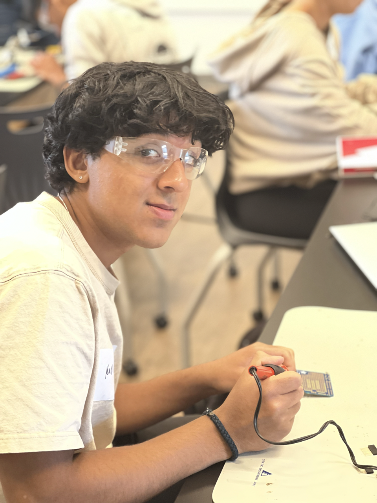

# Mini Tank Robot 

I decided to build a mini-tank robot. It can use treads to move, and it also has various sensors that it can use to detect its environment and have various reactions. 

| **Engineer** | **School**                 | **Area of Interest**   | **Grade** |
|:--:|:--:|:--:|:--:|
| Kapil A       | Menlo Atherton High school | Electrical Engineering | Incoming Sophomore 



  

# Final Milestone>
### Summary 
For this milestone, I made it so the tank would be able to avoid objects. It works by the ultrasonic sensor being able to read the distance between itself and whatever is in front of it. If the ultrasonic sensor was 5 inches or closer to an object it would check if the left was clear if so it would turn to the left and go that direction if the left was not clear then it would check the right, if the right was not clear it would backup and turn around and go the opposite direction. 
For your final milestone, explain the outcome of your project. Key details to include are:
- What you've accomplished since your previous milestone
 - What your biggest challenges and triumphs were at BSE
- A summary of key topics you learned about
- What you hope to learn in the future after everything you've learned at BSE

**Don't forget to replace the text below with the embedding for your milestone video. Go to Youtube, click Share -> Embed, and copy and paste the code to replace what's below.**

<iframe width="560" height="315" src="https://www.youtube.com/embed/F7M7imOVGug" title="YouTube video player" frameborder="0" allow="accelerometer; autoplay; clipboard-write; encrypted-media; gyroscope; picture-in-picture; web-share" allowfullscreen></iframe>>
-->
# Second Milestone
<iframe width="560" height="315" src="https://www.youtube.com/embed/aJizkXOvEMc" title="YouTube video player" frameborder="0" allow="accelerometer; autoplay; clipboard-write; encrypted-media; gyroscope; picture-in-picture; web-share" allowfullscreen></iframe>
### Summary 
for my second milestone, I wrote code so that I was able to run the robot using Bluetooth. With that code with different inputs, I would match the input and if it was the correct input I would either make the robot go forward backward or turn left or right.  
I didn't use any new components I just programmed the motors to control their speed in direction. because they are dc motors they have two directions, so when programming them if I want it to turn right I have one motor turning normally while the other turns right. 
### Progress 
for my customization, I was able to add functionality with an ultrasonic sensor where it would follow an object. 
### Challenges faced 
One challenge I faced was with coding it I didn't really understand the way that the Bluetooth inputs were read so I didn't know how to make it so my robot was controlled. I then figured out I have to save my inputs as a variable then I used those to if I had a certain input it would drive a certain way whether it turned or went forwards or backward. Another challenge with driving it was one of the wheels wouldn't be powered, the reason for this is I was connected to one 9 volt battery which was running low on battery and two wasn't giving enough power so I soldered two of the 9-volt battery clips together so I could use two 9 volt batteries. 
### Next steps 
Next, I plan to add extra functionality with different sensors such as the photoresistors to react to the light levels and work with other sensors. 


# First Milestone
<iframe width="560" height="315" src="https://www.youtube.com/embed/kHHo6Isvda4" title="YouTube video player" frameborder="0" allow="accelerometer; autoplay; clipboard-write; encrypted-media; gyroscope; picture-in-picture; web-share" allowfullscreen></iframe> 

### Summary 
my first milestone with the mini tank robot was to assemble it and test all the components. I was able to successfully test the ultrasonic sensor, the photoresistors, the servo, and the Bluetooth module

the components that were included in the kits were
- two photoresistors that change their resistance based on the light level.
- an IR sensor, which detects infrared signals.
- an ultrasonic sensor, which detects how far away an object is
- two dc motors.
- two treads
- two wheels
- panels for assembly
- a servo, which can make precise turns.
- an Arduino microcontroller
- an 1298p motor controller
-  a sensor shield v2
- and an led panel

Building the tank involved a few things I first had to assemble the wheel and the drive of it. For that, there was a prebuilt structure to which I could mount a DC motor to which I attached a wheel, I would also have another wheel on the same piece which would be connected so they can turn each other. There are two of those drives and I would mount a panel on top of those which contains the electronics such as the Arduino microcontroller and the attachments like the motor controller and the sensor shield. The motor controller is used to power the motor and makes me able to program their speed and direction. I can use the sensor shield to connect all the components to my Arduino. With the components and sensors, I can add extra functionality, where I can use them all to help react to its environment.
### Challenges Faced
 One challenge I faced was with the software particularly when it came to the IR sensor which I wasn't able to get working properly because the library wasn't working.
 ### Next Steps 
 After this, I plan to get the IR sensor working and get remote-controlled driving capabilities with either the Bluetooth or IR sensor and use those inputs to power the motors and make the robot drive wirelessly. 

# Starter Project
<iframe width="560" height="315" src="https://www.youtube.com/embed/oUL4bk-k7ME" title="YouTube video player" frameborder="0" allow="accelerometer; autoplay; clipboard-write; encrypted-media; gyroscope; picture-in-picture; web-share" allowfullscreen></iframe>
### Summary 

My starter project was the custom Arduino project. I made a thing using Arduino, that when you are at least ten centimeters from the ultrasonic sensor you would turn on an LED. If you were more than ten centimeters away it would turn off.

the components I used were 
-  an Arduino which is a microcontroller 
-   an adafruit proto shield on which I could make custom circuits on 
-    an led which provides light and an output
-    a resistor, which reduces and regulates the flow of current. 
- jumper wire, which connects components  
- and an ultrasonic sensor, which detects how far an object is.

all of the components are soldered to the proto shield which is connected to the Arduino which provides it power. and the connections needed. I used the jumper wires to wire them on Arduino connections to the ground and the five-volt connection. I also connected the ultrasonic sensor to a different ground and five-volt connection. I soldered the output of the ultrasonic sensor which went to the resistor which went to a resistor that regulated the current that went to an led which were all  soldered onto the proto shield. 
### Challenges Faced 
   A challenge I faced was getting the circuit right and issues with shorting.
  I first designed the circuit on a breadboard which taught me a lot about how circuits work and Power Rails, but when soldering it the circuit kept shorting. I realized that the board to which I was soldering the components had power rails that were already powered by a 5-volt connection so when I connected them to ground it would short. What I had to do was remake the circuit on a different part of the board which wouldn't already have a five-volt connection. For that, I had to make my own connections between the components because they didn't have power rails. 


<!---
# Schematics 
Here's where you'll put images of your schematics. [Tinkercad](https://www.tinkercad.com/blog/official-guide-to-tinkercad-circuits) and [Fritzing](https://fritzing.org/learning/) are both great resoruces to create professional schematic diagrams, though BSE recommends Tinkercad becuase it can be done easily and for free in the browser. 

# Code
Here's where you'll put your code. The syntax below places it into a block of code. Follow the guide [here]([url](https://www.markdownguide.org/extended-syntax/)) to learn how to customize it to your project needs. 
-->
# Code
the code for the Bluetooth controlled bot 
```c++

#define ML_Ctrl 13  //define the direction control pin of left motor
#define ML_PWM 11   //define the PWM control pin of left motor
#define MR_Ctrl 12  //define direction control pin of right motor
#define MR_PWM 3   // define the PWM control pin of right motor
char ble_val; //character variable: save the value of Bluetooth reception
void setup()
  
{
  Serial.begin(9600);
  myservo.attach(9); 
  pinMode(ML_Ctrl, OUTPUT);//define direction control pin of left motor as output
  pinMode(ML_PWM, OUTPUT);//define PWM control pin of left motor as output
  pinMode(MR_Ctrl, OUTPUT);//define direction control pin of right motor as output.
  pinMode(MR_PWM, OUTPUT);//define the PWM control pin of right motor as output
}

void loop(){
  if (Serial.available())
  {
    ble_val = Serial.read();
    Serial.println(ble_val);
  }
switch (ble_val)
  { 
    case 'f':
      digitalWrite(ML_Ctrl,LOW);
      analogWrite(ML_PWM,100);
      digitalWrite(MR_Ctrl,LOW);
      analogWrite(MR_PWM,100);
      break; 
  //front
    case 'b':
      digitalWrite(ML_Ctrl,HIGH);
      analogWrite(ML_PWM,100);
      digitalWrite(MR_Ctrl,HIGH);
      analogWrite(MR_PWM,100);
      break; 
   //back
    case 'l':
      digitalWrite(ML_Ctrl,HIGH);
      analogWrite(ML_PWM,200);
      digitalWrite(MR_Ctrl,LOW);
      analogWrite(MR_PWM,200);
      break;
    //left
    case 'r':
      digitalWrite(ML_Ctrl,LOW );
      analogWrite(ML_PWM,200);
      digitalWrite(MR_Ctrl,HIGH);
      analogWrite(MR_PWM,200);
      break;
   //right
    case 's':
      analogWrite(ML_PWM,0);
      analogWrite(MR_PWM,0);
      break;
    //stop
  }

}
```
<!--
# Bill of Materials
Here's where you'll list the parts in your project. To add more rows, just copy and paste the example rows below.
Don't forget to place the link of where to buy each component inside the quotation marks in the corresponding row after href =. Follow the guide [here]([url](https://www.markdownguide.org/extended-syntax/)) to learn how to customize this to your project needs. 

| **Part** | **Note** | **Price** | **Link** |
|:--:|:--:|:--:|:--:|
| Item Name | What the item is used for | $Price | <a href="https://www.amazon.com/Arduino-A000066-ARDUINO-UNO-R3/dp/B008GRTSV6/"> Link </a> |
|:--:|:--:|:--:|:--:|
| Item Name | What the item is used for | $Price | <a href="https://www.amazon.com/Arduino-A000066-ARDUINO-UNO-R3/dp/B008GRTSV6/"> Link </a> |
|:--:|:--:|:--:|:--:|
| Item Name | What the item is used for | $Price | <a href="https://www.amazon.com/Arduino-A000066-ARDUINO-UNO-R3/dp/B008GRTSV6/"> Link </a> |
|:--:|:--:|:--:|:--:|

# Other Resources/Examples
One of the best parts about Github is that you can view how other people set up their own work. Here are some past BSE portfolios that are awesome examples. You can view how they set up their portfolio, and you can view their index.md files to understand how they implemented different portfolio components.
- [Example 1](https://trashytuber.github.io/YimingJiaBlueStamp/)
- [Example 2](https://sviatil0.github.io/Sviatoslav_BSE/)
- [Example 3](https://arneshkumar.github.io/arneshbluestamp/)

To watch the BSE tutorial on how to create a portfolio, click here.
-->
